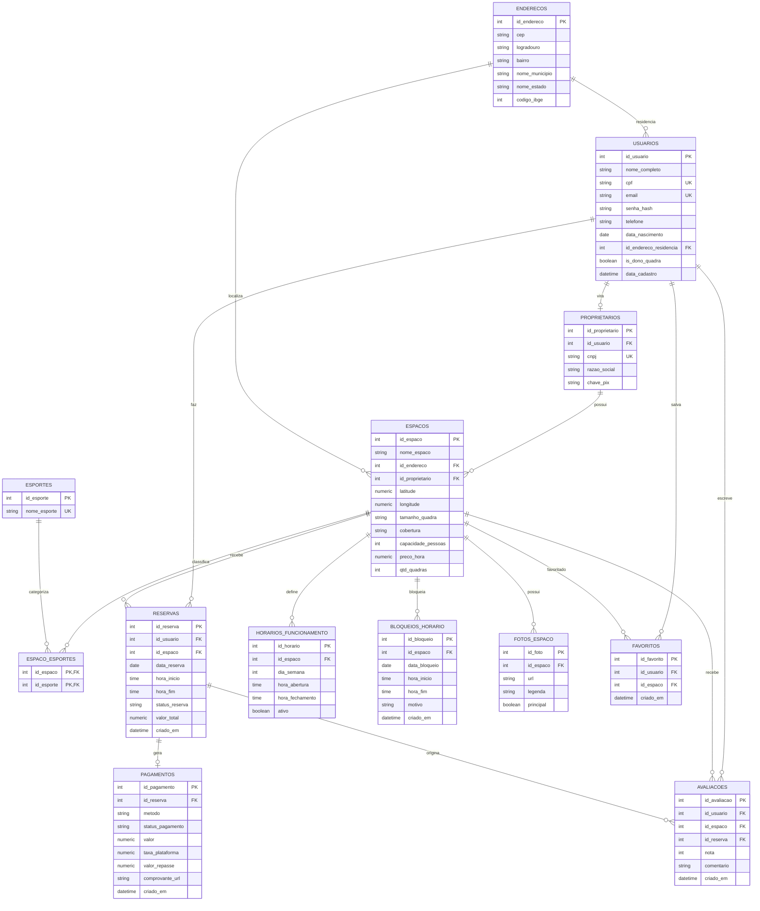

# Diagrama ER do Banco

Este diagrama representa as tabelas definidas em `app/models/entities.py`.

```mermaid
erDiagram
    ENDERECOS {
        int id_endereco PK
        string cep
        string logradouro
        string bairro
        string nome_municipio
        string nome_estado
        int codigo_ibge
    }

    USUARIOS {
        int id_usuario PK
        string nome_completo
        string cpf UK
        string email UK
        string senha_hash
        string telefone
        date data_nascimento
        int id_endereco_residencia FK
        boolean is_dono_quadra
        datetime data_cadastro
    }

    PROPRIETARIOS {
        int id_proprietario PK
        int id_usuario FK
        string cnpj UK
        string razao_social
        string chave_pix
    }

    ESPORTES {
        int id_esporte PK
        string nome_esporte UK
    }

    ESPACOS {
        int id_espaco PK
        string nome_espaco
        int id_endereco FK
        int id_proprietario FK
        numeric latitude
        numeric longitude
        string tamanho_quadra
        string cobertura
        int capacidade_pessoas
        numeric preco_hora
        int qtd_quadras
    }

    ESPACO_ESPORTES {
        int id_espaco PK, FK
        int id_esporte PK, FK
    }

    RESERVAS {
        int id_reserva PK
        int id_usuario FK
        int id_espaco FK
        date data_reserva
        time hora_inicio
        time hora_fim
        string status_reserva
        numeric valor_total
        datetime criado_em
    }

    AVALIACOES {
        int id_avaliacao PK
        int id_usuario FK
        int id_espaco FK
        int id_reserva FK
        int nota
        string comentario
        datetime criado_em
    }

    HORARIOS_FUNCIONAMENTO {
        int id_horario PK
        int id_espaco FK
        int dia_semana
        time hora_abertura
        time hora_fechamento
        boolean ativo
    }

    BLOQUEIOS_HORARIO {
        int id_bloqueio PK
        int id_espaco FK
        date data_bloqueio
        time hora_inicio
        time hora_fim
        string motivo
        datetime criado_em
    }

    PAGAMENTOS {
        int id_pagamento PK
        int id_reserva FK
        string metodo
        string status_pagamento
        numeric valor
        numeric taxa_plataforma
        numeric valor_repasse
        string comprovante_url
        datetime criado_em
    }

    FOTOS_ESPACO {
        int id_foto PK
        int id_espaco FK
        string url
        string legenda
        boolean principal
    }

    FAVORITOS {
        int id_favorito PK
        int id_usuario FK
        int id_espaco FK
        datetime criado_em
    }

    ENDERECOS ||--o{ USUARIOS : residencia
    USUARIOS ||--o| PROPRIETARIOS : vira
    PROPRIETARIOS ||--o{ ESPACOS : possui
    ENDERECOS ||--o{ ESPACOS : localiza

    ESPACOS ||--o{ ESPACO_ESPORTES : classifica
    ESPORTES ||--o{ ESPACO_ESPORTES : categoriza

    USUARIOS ||--o{ RESERVAS : faz
    ESPACOS ||--o{ RESERVAS : recebe

    USUARIOS ||--o{ AVALIACOES : escreve
    ESPACOS ||--o{ AVALIACOES : recebe
    RESERVAS ||--o{ AVALIACOES : origina

    ESPACOS ||--o{ HORARIOS_FUNCIONAMENTO : define
    ESPACOS ||--o{ BLOQUEIOS_HORARIO : bloqueia
    RESERVAS ||--o| PAGAMENTOS : gera
    ESPACOS ||--o{ FOTOS_ESPACO : possui

    USUARIOS ||--o{ FAVORITOS : salva
    ESPACOS ||--o{ FAVORITOS : favoritado
```
